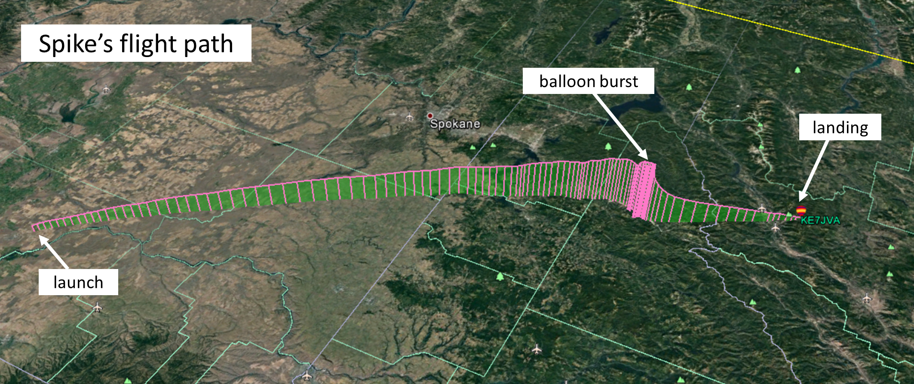
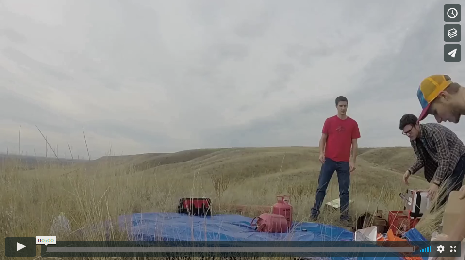
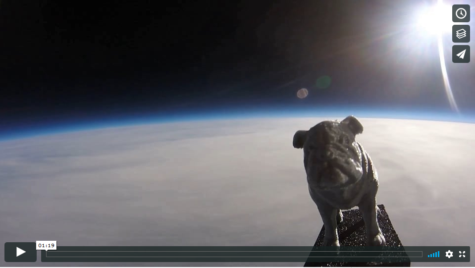
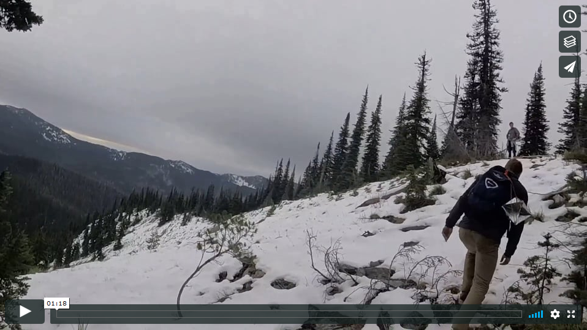
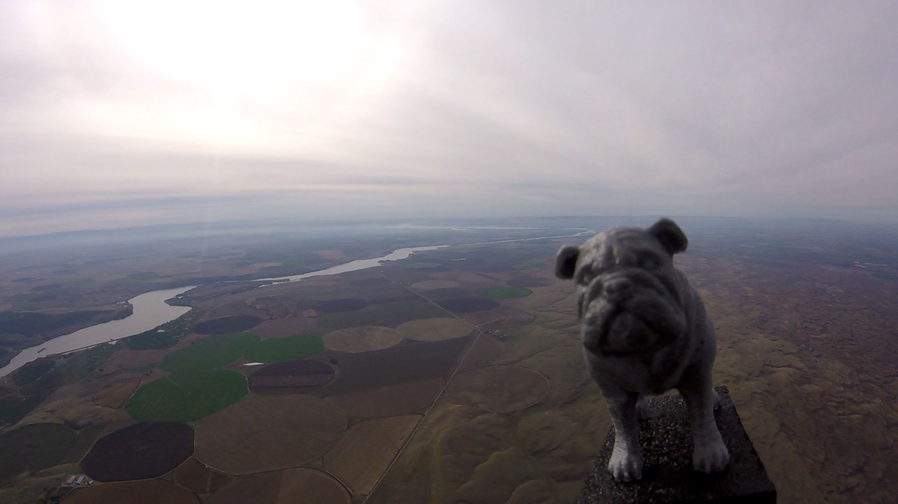
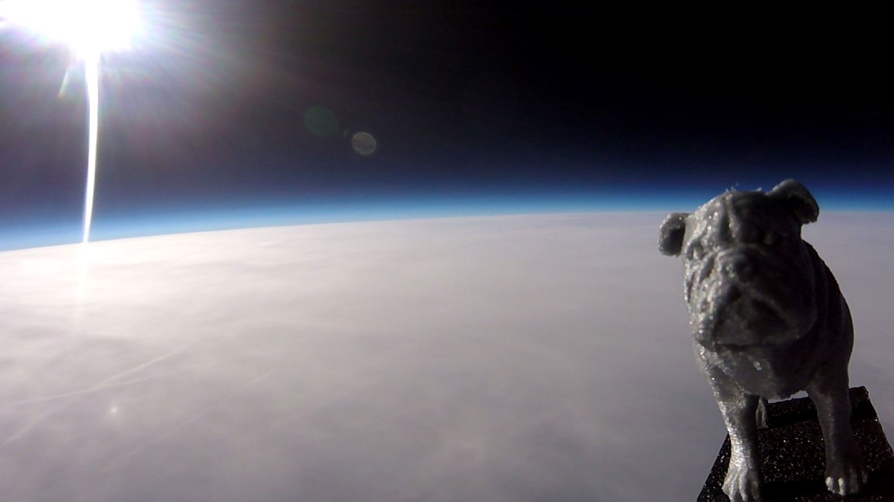

# Spike Goes to Space!
Photos and video from a high altitude balloon project

  

## Description
Three friends from the Mechanical Engineering Department at Gonzaga University decided to work on a fun project in their free time. They decided to make a 3D-printed version of Spike (Gonzaga's mascot), attach him to a large weather balloon, and get some amazing film as he soars miles above the earth. They used an APRS radio system to track the payload's GPS location in real-time. Come launch day, the payload ended up landing over 250 miles from the launch point due to innaccurate weather forecasts and flight path predictions. It took traveling overnight and hiking through a remote, snowy forest to recover the payload, but it was well worth it for the footage and the memories! We hope you enjoy the videos and photos posted below!

  

## Video

### Launch

### Ascent

### Recovery

## Photos

    

    

  

   

   

## Team
- Walker Capra-Smith
- Tyler Hamke
- Harrison Van Til

  

